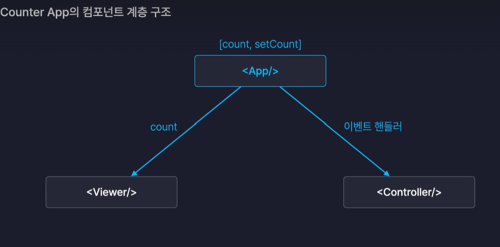

## 카운터 앱

#### 컴포넌트 
- <Viewer/> : 카운트 넘버 표시
- <Controller/>: 카운트를 늘리거나 줄이는 버튼이 있음
- <App/>: 이 두개의 컴포넌트를 렌더링하도록 하는 부모 컴포넌트 역할

#### 기능
- 버튼들을 클릭했을 때 Viewer컴포넌트에 있는 Count number를 증가시키고 감소키는 기능 -> 변경된 값을 화면에 즉시 렌더링 -> 값을 State로 만들어줘야함. 
-> 어느 컴포넌트? (State는 컴포넌트안에서만 만들 수 있기 때문에 )
-> App컴포넌트에서 만들어줘야함.
-> 왜? Viewer과 Counter은 서로 부모자식 관계가 아님. 그래서 어떠한 값도 서로 공유할 수 없음. 
-> props는 부모에서 자식으로만 전달이 가능함.
-> 형재자매관계인 Viewer와 Controller는 서로 데이터를 props로 전달한다는 것 자체가 불가능.
-> Viewer에서 State를 만들 때[count, setCount]라고 하면 상태변화함수인 setCount를 Controller에게 넘겨줄 수 없음.

- 왜 이벤트 헨들러를 사용할까?
버튼을 누르면 해당 숫자만큼 더하고 빼야함.
-> 그러려면 App컴퍼넌트에서 Controller컴퍼넌트에세 count와 setCount를 다 넘겨줘야함
<button onClick={() => setCount(count - 1)}>-1</button>
-> 이것보다 좋은 방식이 App컴퍼넌트에 이벤트 헨들러를 만드는 것.

#### 최종정리
- State는 반드시 여러 컴퍼넌트들의 공통 분모가 되는 부모 컴퍼넌트에 만들어야함. 
- State를 계층구조상에서 위로 끌어올려서 그 아래에 있는 컴포넌트들이 모두 공유할 수 있도록 만드는 방법을 State Lifting(State 끌어올리기)라고 함.
- React.js의 데이터 흐름 = 단방향 데이터 흐름 (파악하기가 매우 쉽고, 직관적임)