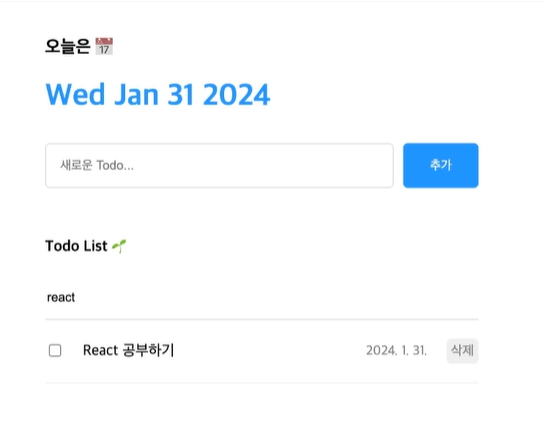
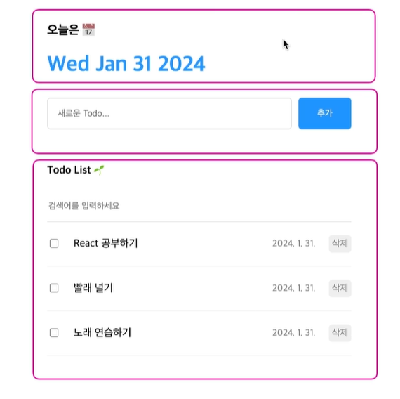

# section8 프로젝트2. 투두리스트

## 8.1 프로젝트 소개 및 준비

ToDo List 만들기

1. 최상단: 오늘의 날짜

2. 페이지 중앙 새로운 투두를 입력하는 폼과 추가 버튼

3. 추가 버튼을 누르면 페이지 하단에 입력한 새로운 투두가 추가됨.

4. 기존에 투두들이 리스트형태로 렌더링 되고 있음.

5. 투두 아이템에 왼쪽 체크박스를 클릭하면 체크가 들어옴. (투두 완료)

6. 삭제 버튼 -> 특정 투두 삭제

7. 투두들을 이름으로 검색 가능

## 8.2 UI 구현하기

Todo의 UI 구현하기

Header component

- '오늘은' 이라는 글자

- 그 아래에 오늘의 날짜 표시

- `<h1>{new Date().toDateString()}</h1>` : 문자열로 읽기 편한 형태로 데이트 렌더링(객체 바로 렌더링하면 오류발생)

Editor component

- 새로운 Todo..라고 쓰여있는 input, 그 옆에 추가버튼

List component

- 가장 위에 Todo List text

- search bar

- ToDo item들이 list형태로 나열 (체크박스, Todo 콘텐츠, Todo의 날짜, 삭제 버튼)

## 8.3 기능 구현 준비하기

구현해야할 기능

1. Editor에 새로운 Todo를 입력하고 추가 버튼을 누르면 아래에 list component에 바로 추가되어야 함.

2. 추가된 todo item들을 list component 내부에서 체크 수정, 삭제할 수 있어야함.

3. 검색까지 가능해야함.

=>Todo data를 state로 만들어 보관해야함. (추가, 수정, 삭제되었을 때 화면에 바로 그 변화를 반영할 수 있게하기 위함)

=>state : App 컴포넌트에 배치 (모든 컴포넌트들의 조상)

## 8.4 Create - 투두 추가하기

객체 todos 배열에 추가할 떄 절대로 `todos.push(newTodo)`라고 하면 안됨.

->todos와 같은 state값은 상태변화함수를 통해서만 수정할 수 있기 때문. 이렇게 해야만 변경된 state값을 react가 감지할 수 있고, 그럼으로써 컴포넌트를 정상적으로 렌더링 시켜주기 때문.

->`setTodos([newTodo, ...todos]);` 작성하기

- 우리가 추가하고자 하는 데이터: newTodo
- ...todos : 기존의 todos 배열과 완전 동일한 데이터

todo 입력창(input 태그)에 입력하는 값이 코드 상의 content state에 잘 보관이 됨.

추가 버튼을 클릭했을 때 onCreate() 함수를 호출하면서 인수로는 이 콘텐츠 state에 보관된 값을 전달하게 됨.

[문제]

1. 빈 문자열을 추가해도 개발자모드로 보면 빈 문자열도 추가가 되어있음.

=>Editor.jsx에 onSubmit에 기능 추가 (content가 빈 문자열이면 바로 return)

2. 입력하고 추가되었다고 해도 입력 폼이 비어있지 않아 사용자 입장에서는 추가되었는지 확인하기 어려움.

=>setContent(""); 로 초기화

3. 추가 버튼을 누르지 않고 enter버튼만 눌러도 추가가 될 수 있도록.

=>onKeydown 이벤트 사용 (사용자가 키보드 누르르 때 발생하는 이벤트)

## 8.5 Read -투두리스트 렌더링하기

todos에 담긴 데이터들을 list형태로 화면에 보여주는 기능.=>list component에서 담당

map method의 콜백함수가 처음 실행되었을 때 반환된 값이 첫번째로 렌더링되고, 두번째로 실행되었을 때 반환된 값도 두번재로 렌더링 되고, 마지막으로 세번째로 실행되었을 때 반환된 값도 세번쨰 리스트로 렌더링됨.

검색 기능 구현하기

+검색할 때 대소문자를 구분하지 않고 검색하도록 수정

-> `toLowerCase()` 사용

[오류발생]

- 체크박스같은 form field에 onChange event handler는 안붙이고, checked prop만 전달하여 오류 발생

  ->todo item component의 input 태그에서 checked prop만 전달하고 onChange handler는 설정하지 않은 상태

  =>지금 당장은 수정 못한다는 의미로 'readOnly' 적어주기.

- list 안에 각각의 자식들은 반드시 고유한 key라는 prop을 가져야 함.

  ->리스트로 어떠한 컴포넌트를 렌더링하고 있을 때에는 모든 아이템 컴포넌트에 반드시 key라는 prop을 고유한 값으로 전달해줘야함.

검색 기능 구현 ex. React 입력하면 'React 공부하기'라는 컴포넌트만 나와줘야함.

->이 검색어가 변경이 되면 리스트 컴포넌트가 리 렌더링되어야만 리스트를 다시 바꿀 수 있음.

->검색어를 state로 보관

## 8.6 Update -투두 수정하기

체크박스를 클릭하면 파란색으로 불이 들어오거나 꺼지도록 기능 구현 (체크박스를 클릭했을 때 하나의 아이템이 수정되는 기능)

TodoItem input에서 onClick이 아니라 onChange event handler를 사용한 이유

->요소가 버튼이 아니라 input 요소이기 때문. 사실 동작은 클릭으로 볼 수 있지만, 결국 그것으로 인해 발생하는 이벤트는 체크박스에 체크가 변경되는 이벤트에 가까우므로 onChange라는 event handler를 사용함.

## 8.7 Delete - 투두 삭제하기

삭제 버튼 클릭하면 todo item이 리스트에서 삭제가 되는 기능 구현

[배운점]

1. display: flex; 속성을 이용하여 원하는 요소를 가로로 배치할 수 있음.

2. App component에서 배열 형태의 데이터를 만들어서 그 데이터를 리스트 형태로 렌더링하는 방법에 대해 알아봄.

3. 이러한 데이터를 새롭게 추가, 제거, 수정, 검색하는 방법 알아봄.
