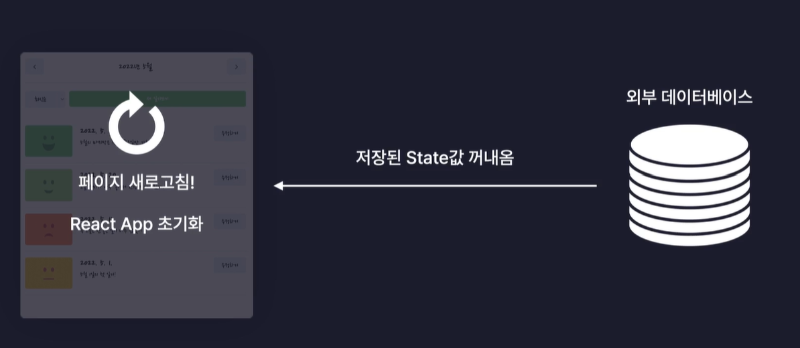
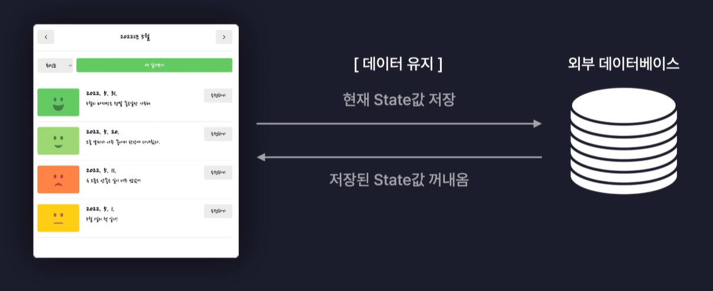
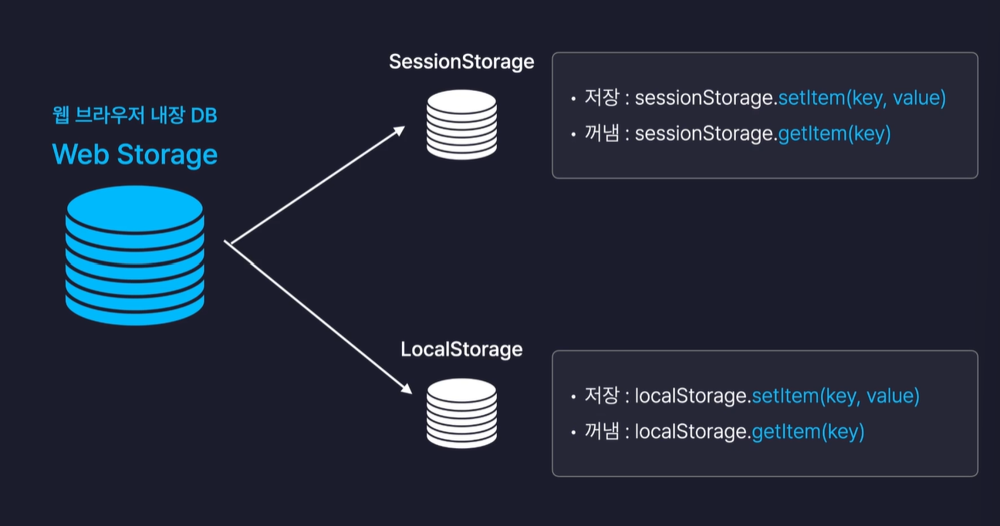

# New 페이지 구현 1.UI

새로운 일기를 생성하는 페이지

Header 컴포넌트, Editor 컴포넌트,EmotionItem 컴포넌트

# New 페이지 구현하기 2.기능

navigate에 인수로 -1을 보내면 페이지를 뒤로 이동시켜줌

작성 완료 버튼이 클릭이 되면 onSubmit 함수가 호출이 됨. 인수는 input state. 그 후 onSubmit 함수가 호출이 되면서 useContext를 통해서 앱 컴포넌트로부터 공급받은 onCreate함수가 호출이 되면서 실제로 일기 데이터가 잘 추가됨을 확인할 수 있음.

replace: true -> 뒤로가기 방지

새로고침하면 데이터가 다시 사라짐.(React app이 처음부터 다시 렌더링된다는 뜻)

# Edit 페이지 구현하기

기존 일기를 수정하는 페이지

Header 컴포넌트, Editor 컴포넌트

# Diary 페이지 구현하기

하나의 일기를 조회하는 페이지

Header 컴포넌트, Viewer 컴포넌트

# 웹 스토리지 이용하기

웹 스토리지(Web Storage): 데이터를 브라우저에 보관하는 방법, 일종의 DB

배포 준비하기: 프로젝트를 배포하기 전, 타이틀, Favicon, OG 설정 진행

배포하기: 리액트 앱을 배포하는 방법

(감정 일기장에서는 최적화 진행 X -> 최적화할 부분 별로 없음)

최적화는 언제 필요할까? 비용이 많이 드는 계산(API 호출~데이터 가공~~~ 작업들), 혹은 매우 여러번, 반복적으로 실행되는 연산

React 렌더링 최적화 기능: useMemo, useCallback, React.memo -->> but 너무 과하면 독이됨

우리가 추가한 일기 데이터는 실제로는 React state에 보관되는데 이것은 자바스크립트의 변수라고도 생각할 수 있음.(브라우저를 새로고침하면 데이터가 다시 사라짐)

웹 브라우저 내장 DB: Web Storage

- 웹 브라우저에 기본적으로 내장되어있는 데이터베이스
- 별도의 프로그램 설치 필요 X, 라이브러리 설치 필요 X
- 그냥 자바스크립트 내장함수 만으로 접근 가능
- ex.값을 저장: localStorage.setItem(key, value)
- ex.값을 꺼냄: localStorage.getItem(key)

sessionStorage

- 브라우저 탭 별로 데이터 보관
- 탭이 종료되기 전에는 데이터 유지(새로고침)
- 탭이 종료되거나 꺼지면 데이터 삭제

LocalStorage

- 사이트 주소별로 데이터 보관
- 사용자가 직접 삭제하기 전까지 데이터 보관

`JSON.parse(undefined);` ->오류 발생

# 배포 준비하기

배포 준비를 위해 해야할 작업

- 페이지 타이틀 설정 : 웹 브라우저 탭에 표시되는 페이지의 제목
- Favicon : 브라우저 탭에 표시되는 작은 아이콘
- 오픈 그래프: 웹사이트의 링크를 공유할 때 썸네일, 제목 등의 정보를 노출하는 것
- 프로젝트 빌드(Build) : 빌드 시 문제 없는지 확인

# 배포하기

클라우드 서버 : 이미 잘 구축되어있는 웹 서버의 공간을 임대하는 것.

클라우드 서비스 ex. AWS, GCP, Firebase, Netlify, Vercel

Vercel: 프론트엔드 개발자를 위한 클라우드 서비스. React.js의 확장판 개념인 Next.js를 개발하는 회사

# 마치면서

1.나만의 것으로 만드는 학습 방법

'나만의 것'이 되었다고 판단할 수 있는 기준: 다른 사람에게 설명할 수 있는 상태.

-> 가르치기(가르칠 사람이 없다면 블로그도 추천)

2.앞으로의 학습 방향에 대한 추천

함께 자라기, 애자일로 가는길 "김창준" 책 추천 -> 개발자 공부 방법이나 협업 방법 등에 대한 설명

몰입 가능 영역에 존재하는 학습을 하는 것을 추천

Q.몰입이 가능한 주제는 어떻게 찾을 수 있는가

- 새로운 키워드 수집 : 많은 키워드를 알고 있을수록 새로운 학습 주제를 찾기 용이함.
- 어려운 과제의 난이도 낮추기 : 언젠가 해보고 싶지만 지금은 너무 어려운 프로젝트. 몇가지 기능을 제거해서 난이도 낮춰보기 (미니 버전 프로젝트 진행)
- 내 실력 높이기 : 무엇을 해야 할지 감도 잡히지 않는다면, 나의 실력을 올려야하는 시기
- 나의 실력을 낮추기 (모래주머니 달기)
